# 📡 AppRadar-Live

**AppRadar-Live** 是一款专为 macOS 开发者和 AI 爱好者设计的**多源应用管理与轻量系统监视器**。它能全自动扫描您电脑上来自 App Store、Homebrew、Node.js / npm、Git 本地仓库及 Docker 容器等多种渠道的工具与服务，为您提供一键式状态监控、进程管理以及全自动的镜像/包升级服务。

---

## 💡 研发背景与痛点

随着 **AI vibe coding** 的兴起，越来越多的人开始在 macOS 上频繁使用和安装各类 AI 工具（如 OpenClaw、HermesAgent 等）。这些工具底层依赖复杂的开发环境（如 Python、Node.js 等），且安装来源极其多样：
* 官网二进制安装包直接下载（DMG/PKG）
* 克隆源代码到本地进行编译与运行（Git 仓库）
* 通过 NPM 一键全局安装（Node.js）
* 部署在本地的 Docker 容器中
* 通过 Homebrew 等包管理器安装

对于普通用户或小白开发者而言，这带来了极高的管理和维护成本：
1. **难以追踪更新**：各渠道工具更新频繁，难以一一知晓其最新特性与升级包状态。
2. **升级操作繁琐**：不同来源需要敲不同的终端升级命令，遇到冲突难以简单排查。
3. **工具散落难寻**：多项目同时运行时，忘记本地服务占用哪个端口，或是想临时启停服务，原生活动监视器信息过载且不支持端口搜索。

为了让大家能够**零门槛地使用并统一管理最新的 AI 工具与本地服务**，享受最新特性，AppRadar-Live 应运而生。

---

## ⚡ 核心功能特色

### 1. 一键式多源应用与包管理
支持全自动扫描并根据电脑上安装的开发环境，自动识别出对应项目的安装情况、端口占用及进程状态。
* **多源集成**：集成 App Store、Homebrew、Node.js、Git 及常见第三方安装包，一键式检测更新与卸载。
* **路径与进程控制**：直观展示每个应用的启动路径，支持在界面上一键停止或重启对应进程。
* **便捷控制台访问**：再也不用死记硬背本地服务占用了哪个端口，在界面上点击链接即可一键直达应用背后的控制台。

### 2. 轻量化进程监控 + 端口定位
深度优化进程管理体验，专门筛选出 vibe coding 用户和小白开发者最关心的核心指标：
* **核心指标**：直观展示 CPU 使用率、CPU 时间、内存占用及线程数。
* **独家端口定位**：原生资源管理器不提供端口数据，AppRadar-Live 支持直观列出并搜索每个进程占用的本地端口。当您忘记某个项目的访问地址时，可在列表中快速定位。

### 3. 极简 Docker 容器管理
如果您的 AI 服务或数据库运行在 Docker 中，无需打开复杂的 Docker Desktop，即可在软件内直接操控：
* **状态透视**：直观展示镜像名称、容器 ID、CPU / 内存实时占用情况。
* **快捷控制**：支持一键启动与停止容器。
* **一键镜像更新**：自动检测新版镜像并一键拉取（Pull），软件会自动重新启动容器，让升级无缝衔接。
* **端口跳转**：清晰展示容器的端口映射，支持一键在浏览器中打开访问。

### 4. 智能通知与个性化体验
* **防骚扰智能通知**：仅在检测到新更新包时推送提醒；CPU 占用（≥85%）与内存压力（≥90%）过载报警内置 10 分钟 Cooldown 冷却期，杜绝高频通知轰炸。
* **个性化主题**：软件内置 5 种不同主题配色方案，支持自由切换以满足不同审美偏好。

---

## 📸 界面预览

### 1. 资源监控雷达 (Resource Monitor)
| 系统进程 CPU/内存与端口列表 | Docker 容器指标监控与启停 |
| :---: | :---: |
| 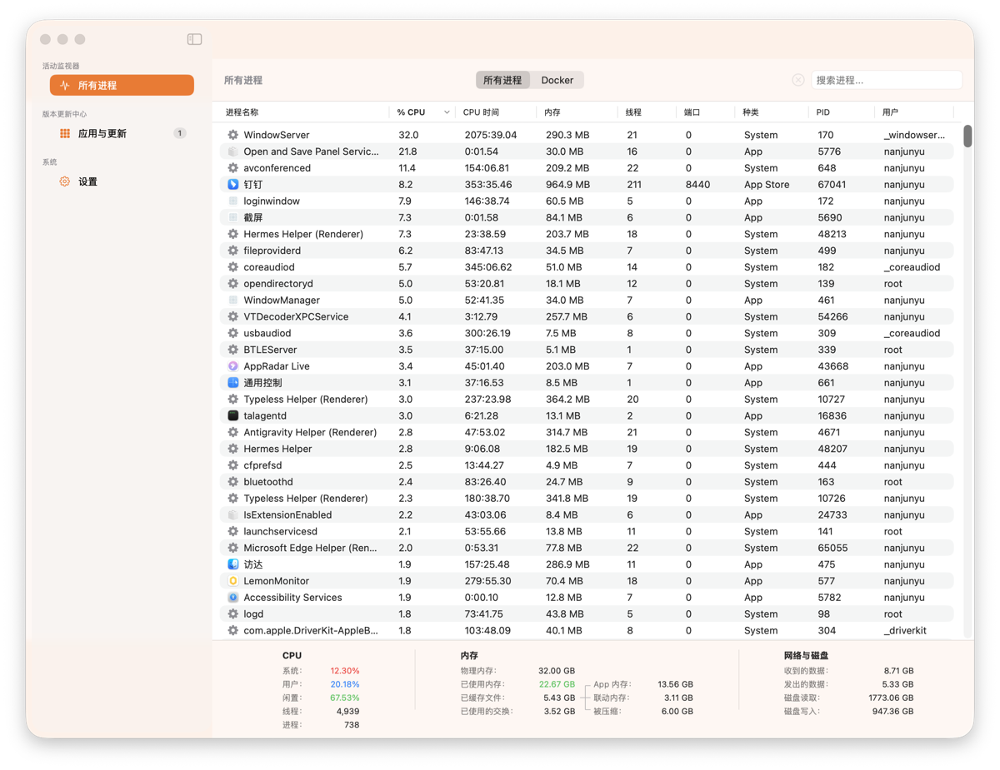 | 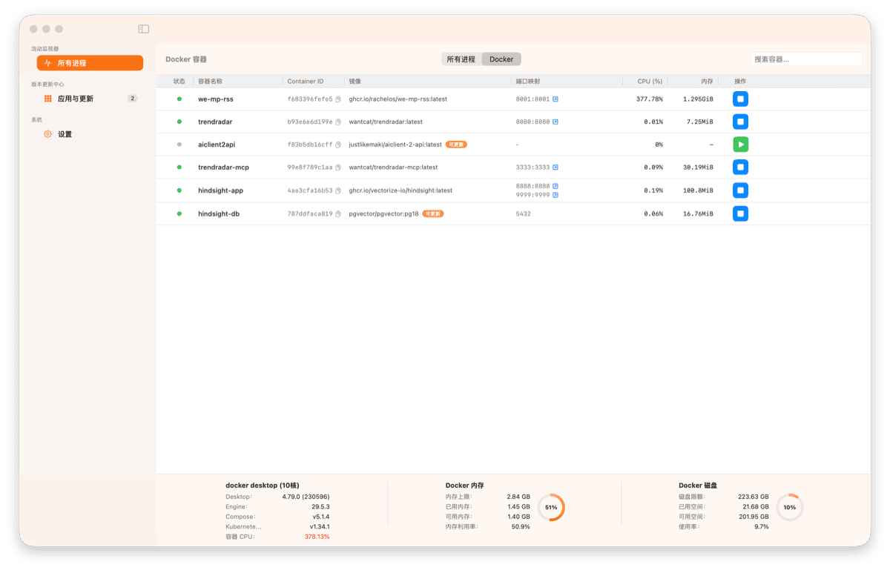 |

### 2. 多源更新管理 (Updates Management)
| 多渠道更新总览列表 | App Store 应用详情展示 |
| :---: | :---: |
| 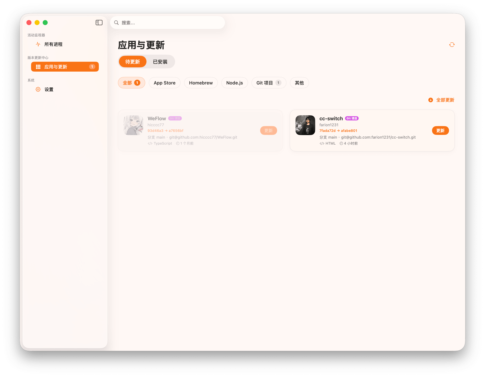 | 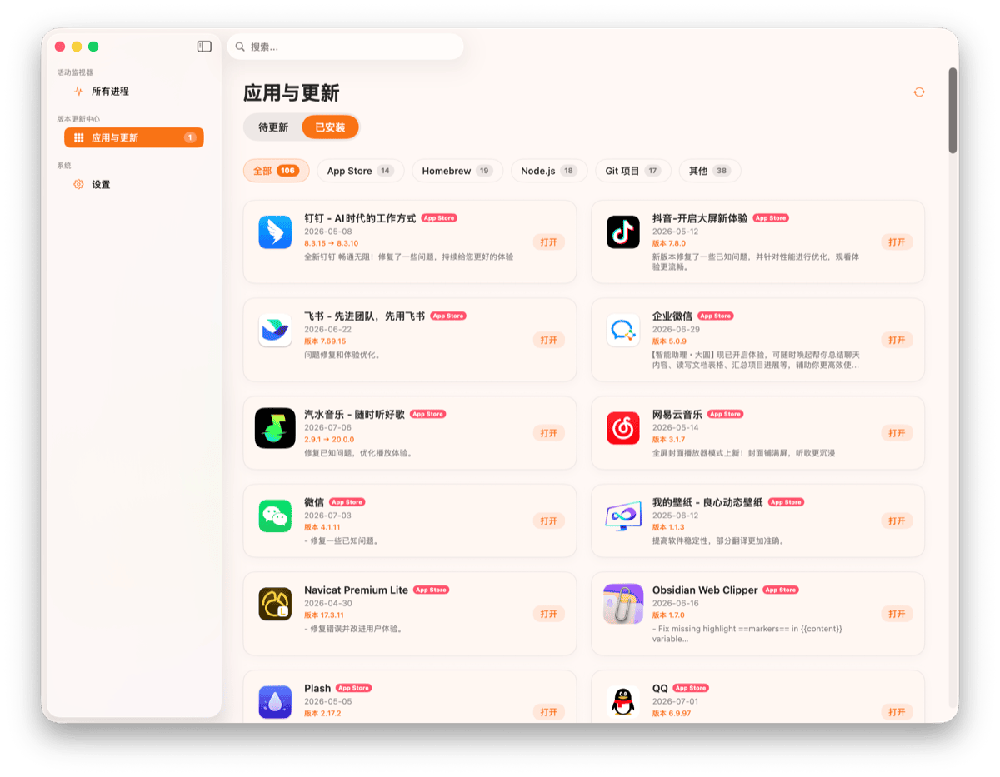 |

| Node.js 全局包更新 | Git 本地项目雷达 |
| :---: | :---: |
| 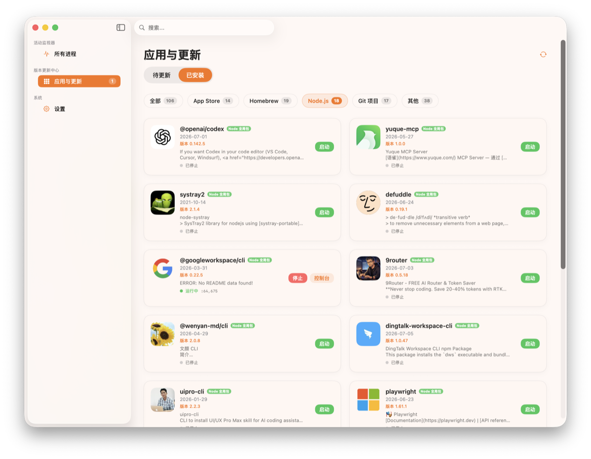 | 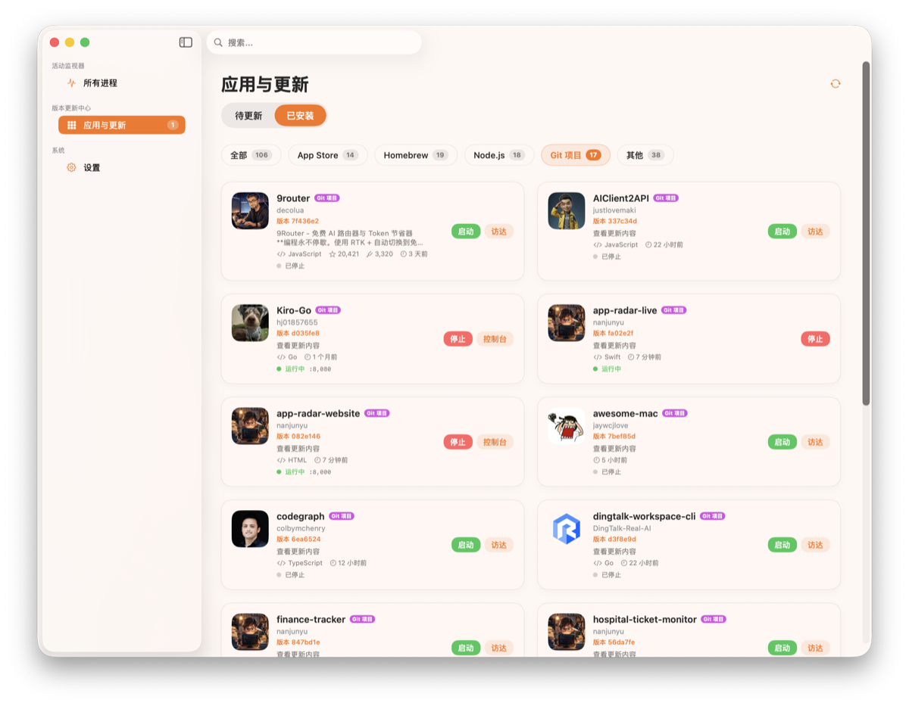 |

### 3. 应用详情与状态栏
| 独立应用详情页 (如 QQ) | CLI 终端工具详情 (如 firecrawl-cli) |
| :---: | :---: |
| 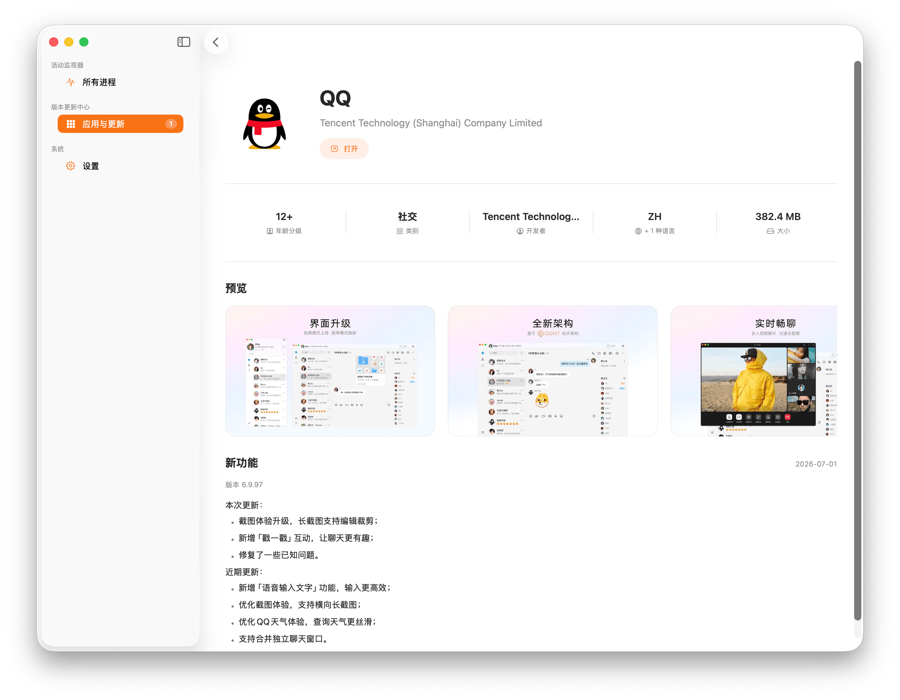 | 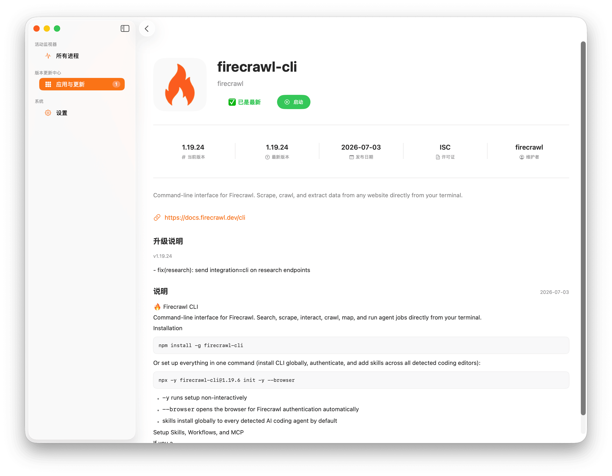 |

| 菜单栏常驻浮窗 (Popover) | 智能防骚扰通知中心 |
| :---: | :---: |
| 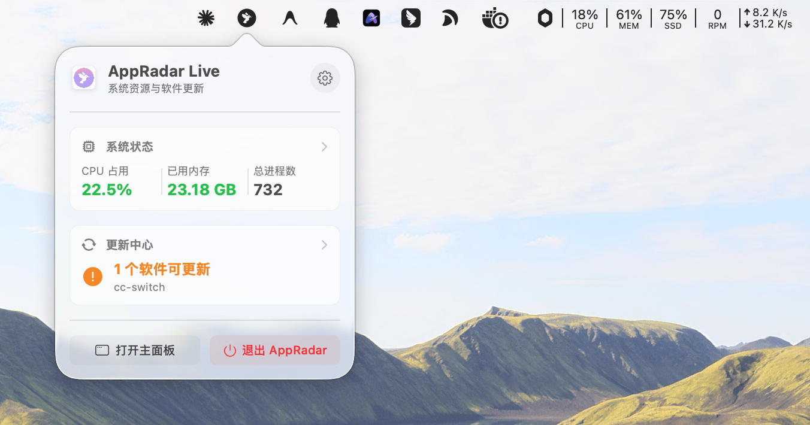 | 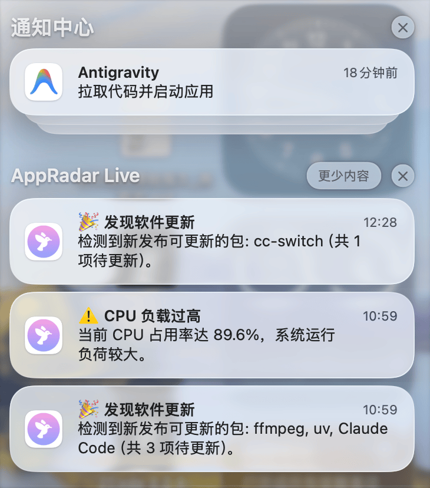 |

| 主题配色切换设置 |
| :---: |
| 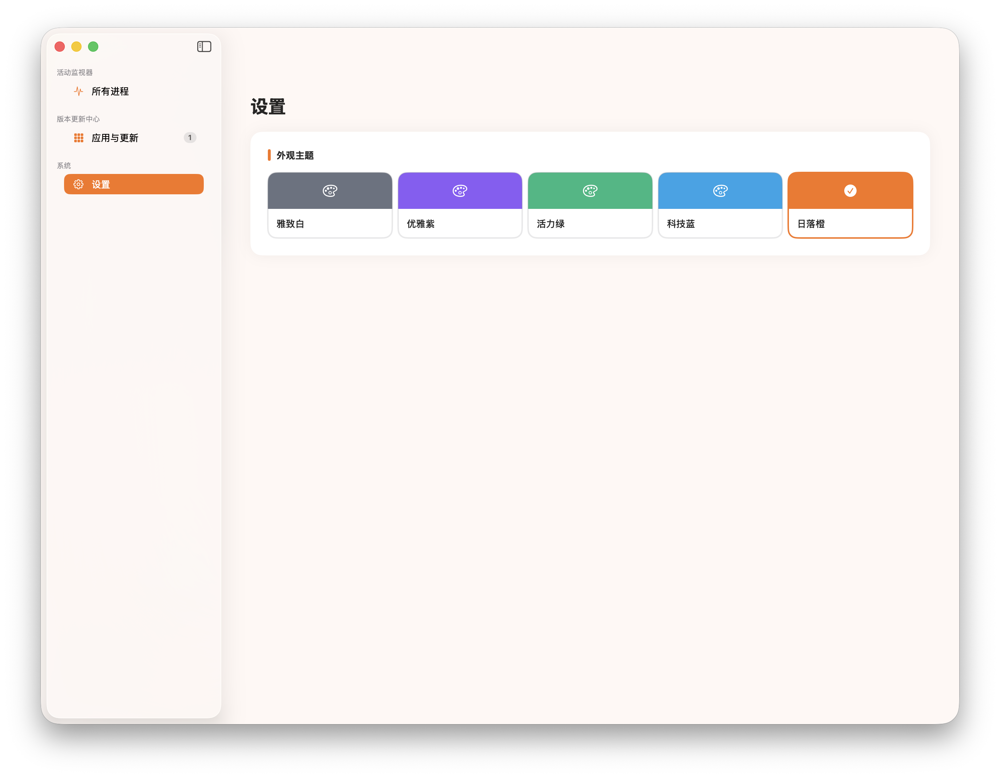 |

---

## 🔧 依赖运行工具

AppRadar-Live 桌面端在运行时会调用以下命令行工具获取数据，请确保已安装：
* **`mas`**：用于读取 App Store 更新列表，可通过 `brew install mas` 安装。
* **`brew`**：用于读取 Homebrew 包更新状态。
* **`docker`**：用于读取容器运行状态与统计（可选）。

---

## 📥 下载与安装

前往 [Releases 页面](https://github.com/nanjunyu/app-radar-live/releases) 下载最新版本的 `.dmg` 安装包：
- **Apple Silicon (M1/M2/M3/M4)** → 下载 `arm64.dmg`
- **Intel 芯片** → 下载 `x86_64.dmg`

> 💡 不确定你的 Mac 是哪种芯片？点击左上角  → 关于本机 → 查看「芯片」或「处理器」信息。

### ⚠️ 首次打开提示"无法验证开发者"的解决方法

由于本应用未上架 App Store，macOS Gatekeeper 会阻止首次打开。请使用以下任一方式解决（仅需操作一次）：

**方式一：右键打开**
1. 在 Finder 中找到 `app-radar-live.app`
2. 按住 `Control` 键点击（或右键点击）→ 选择「打开」
3. 在弹出的对话框中再次点击「打开」

**方式二：终端命令解除限制（推荐）**
```bash
xattr -cr /Applications/app-radar-live.app
```
执行后即可正常双击打开，后续不会再弹窗。

---

## 🚀 从源码编译

如果你希望自行编译，AppRadar-Live 主体是一个 SwiftUI 原生 macOS 应用（适用于 Apple M 系列及 Intel 芯片）。

```bash
cd app-radar-live
./build_app.sh        # 编译并签名生成 app-radar-live.app
open app-radar-live.app
```

启动后，您可以在顶部菜单栏或左侧边栏便捷控制您的全部服务环境，数据默认每 5 秒自动刷新。

---

## 🏗️ 项目结构说明

本地 Swift 源码模块化划分如下：
```
Sources/
├── Core/                              # 通用工具 (进程运行封装、Swift 扩展)
├── Models/                            # 数据模型 (系统进程、容器、更新卡片)
├── Scanner/                           # 核心扫描模块 (按扩展拆分：Docker、进程、多源检测)
└── Views/                             # SwiftUI 界面组件 (侧边栏、主视图、更新中心、表格)
```

---

## 💬 常见问题 (FAQ)

**Q: 这个工具是收费的吗？**
完全免费，且永久开源。AppRadar Live 基于 **MIT 协议**发布，你可以自由查看源代码、修改和分发。我们非常欢迎二次开发与商业用途，无需任何授权或付费。

**Q: 这个工具安全吗？会上传我的数据吗？**
绝对安全。AppRadar Live 是一个**纯本地工具**，不会进行任何形式的数据联网上传。所有扫描、监控、分析均在你的 Mac 本地完成，不连接任何远程服务器，不收集任何用户信息。你的数据始终只属于你。

**Q: 支持哪些 macOS 版本？**
AppRadar Live 支持 **macOS 13 Ventura 及以上**版本，同时提供 Apple Silicon（M 系列芯片）与 Intel 芯片两个原生版本，均可在对应架构上获得最佳性能表现。

**Q: 运行时需要授予哪些权限？**
AppRadar Live 仅需最小必要权限：
- 🔍 **本地文件读取权限**：用于扫描 Homebrew、npm 等安装目录，识别已安装的工具
- ⚙️ **系统进程读取权限**：用于展示 CPU / 内存 / 端口等进程指标
- 🐳 **Docker Socket 访问权限**（可选）：仅在你使用 Docker 管理功能时需要

所有权限均通过 macOS 标准系统授权弹窗申请，无任何隐藏行为。

**Q: 不支持的安装来源能检测到吗？**
目前支持的安装来源包括：**App Store、Homebrew、Node.js / npm、Git 克隆项目、Docker 容器**，以及常见的第三方 DMG 安装包。对于极少数高度定制化的安装方式，可能暂时无法识别，我们会在后续版本持续扩展支持范围，欢迎在 GitHub Issues 中提交你的需求。

**Q: 遇到 Bug 或问题，怎么反馈？**
请前往 [GitHub Issues](https://github.com/nanjunyu/app-radar-live/issues) 提交问题报告，建议附上以下信息以便快速定位：
- 你的 macOS 版本和芯片类型（M 系列 / Intel）
- 问题的复现步骤
- 相关的截图或错误日志

**Q: 怎么参与贡献或共同开发？**
非常欢迎！你可以通过以下方式参与：
- 💡 在 [GitHub Issues](https://github.com/nanjunyu/app-radar-live/issues) 提交功能建议或 Bug 报告
- 🔧 Fork 仓库后提交 [Pull Request](https://github.com/nanjunyu/app-radar-live/pulls)，我们会认真 Review 每一个 PR
- ⭐ 给项目点个 Star，帮助更多人发现这个工具

---

## 🤝 参与贡献

欢迎通过提交 GitHub Issues 或 Pull Request 一起完善这个小工具，期待您的加入！
